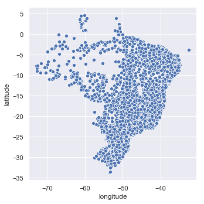
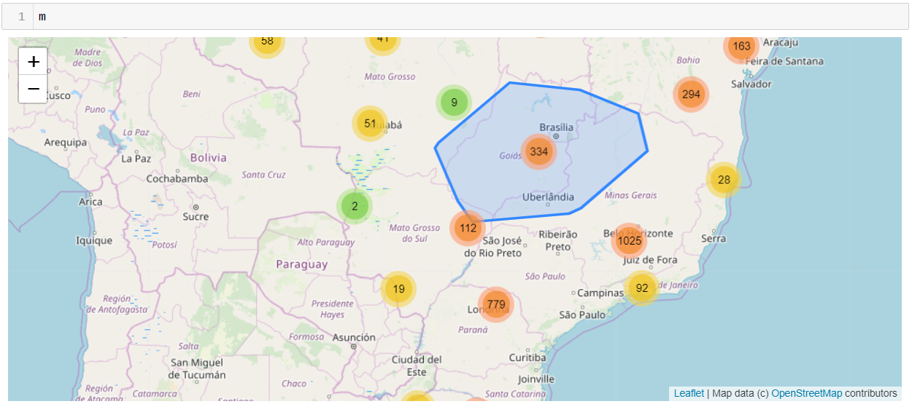
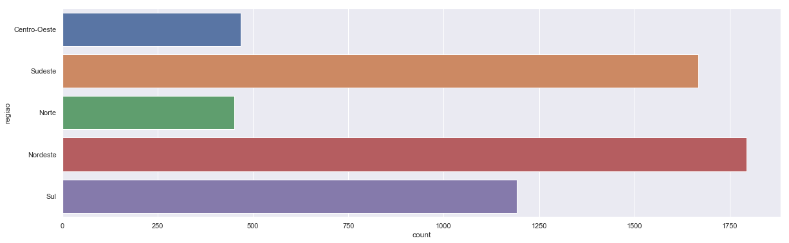
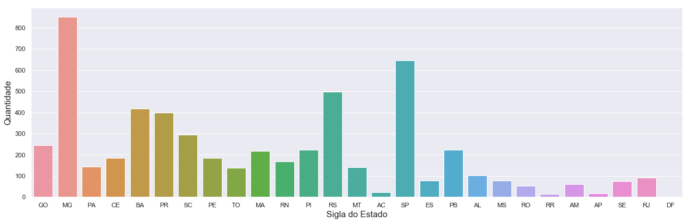
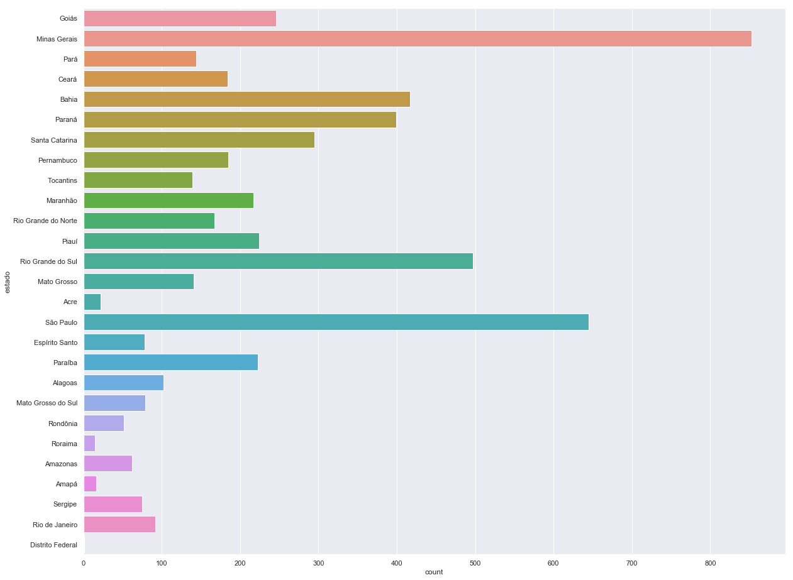

```python
import os 
import warnings
import numpy as np
import pandas as pd
import seaborn as sns
import matplotlib.pyplot as plt

import warnings
warnings.filterwarnings('ignore')

%matplotlib inline
```


```python
from plotly.offline import init_notebook_mode, iplot
from ipyleaflet import Map, Marker, MarkerCluster
init_notebook_mode(connected=True)
```


<script type="text/javascript">window.PlotlyConfig = {MathJaxConfig: 'local'};</script><script type="text/javascript">if (window.MathJax) {MathJax.Hub.Config({SVG: {font: "STIX-Web"}});}</script><script>requirejs.config({paths: { 'plotly': ['https://cdn.plot.ly/plotly-latest.min']},});if(!window._Plotly) {require(['plotly'],function(plotly) {window._Plotly=plotly;});}</script>


```python
brasil=pd.read_csv("brasil.csv", delimiter = ';', encoding = 'utf8') 
```


```python
brasil.head(4)
```


<div>
<style scoped>
    .dataframe tbody tr th:only-of-type {
        vertical-align: middle;
    }

    .dataframe tbody tr th {
        vertical-align: top;
    }

    .dataframe thead th {
        text-align: right;
    }
</style>
<table border="1" class="dataframe">
  <thead>
    <tr style="text-align: right;">
      <th></th>
      <th>ibge</th>
      <th>municipio</th>
      <th>latitude</th>
      <th>longitude</th>
      <th>cod_estado</th>
      <th>estado</th>
      <th>uf</th>
      <th>regiao</th>
      <th>capital</th>
    </tr>
  </thead>
  <tbody>
    <tr>
      <th>0</th>
      <td>520005</td>
      <td>Abadia de Goiás</td>
      <td>-16.7573</td>
      <td>-49.4412</td>
      <td>52</td>
      <td>Goiás</td>
      <td>GO</td>
      <td>Centro-Oeste</td>
      <td>0</td>
    </tr>
    <tr>
      <th>1</th>
      <td>310010</td>
      <td>Abadia dos Dourados</td>
      <td>-18.4831</td>
      <td>-47.3916</td>
      <td>31</td>
      <td>Minas Gerais</td>
      <td>MG</td>
      <td>Sudeste</td>
      <td>0</td>
    </tr>
    <tr>
      <th>2</th>
      <td>520010</td>
      <td>Abadiânia</td>
      <td>-16.1970</td>
      <td>-48.7057</td>
      <td>52</td>
      <td>Goiás</td>
      <td>GO</td>
      <td>Centro-Oeste</td>
      <td>0</td>
    </tr>
    <tr>
      <th>3</th>
      <td>310020</td>
      <td>Abaeté</td>
      <td>-19.1551</td>
      <td>-45.4444</td>
      <td>31</td>
      <td>Minas Gerais</td>
      <td>MG</td>
      <td>Sudeste</td>
      <td>0</td>
    </tr>
  </tbody>
</table>
</div>


```python
sns.relplot(x="longitude", y="latitude", data=brasil)
```


    <seaborn.axisgrid.FacetGrid at 0x1dff3156748>





```python
longitudes = brasil['longitude'].values.tolist()
latitudes = brasil['latitude'].values.tolist()
```


```python
markers = []
for lon,lat in zip(longitudes,latitudes):
    markers.append(Marker(location=(lat,lon)))
m = Map(center=(latitudes[0], longitudes[0]), zoom=4, draggable=True, opacity=3.0)
marker_cluster = MarkerCluster(markers=markers)
m.add_layer(marker_cluster);
```


```python

```


```python
from IPython.display import Image
Image("mapa.png")
```





```python
f, ax = plt.subplots(figsize=(20, 6))
sns.set(style="darkgrid")
sns.countplot(y="regiao", data=brasil, saturation=0.75)
```


    <matplotlib.axes._subplots.AxesSubplot at 0x1dff9268390>





```python
plt.figure(figsize=(20,6))
sns.set(style="darkgrid")
sns.countplot(brasil['uf'].head(5570))
plt.xlabel('Sigla do Estado').set_size(15)
plt.ylabel('Quantidade').set_size(15)
```





```python
f, ax = plt.subplots(figsize=(20, 16))
sns.set(style="darkgrid")
sns.countplot(y="estado", data=brasil, saturation=0.75)
```


    <matplotlib.axes._subplots.AxesSubplot at 0x1dff97a4588>





